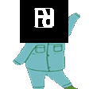

# ✨ My Portfolio Website (ver. 1.0) ✨ 

Welcome to the repo for my **personal portfolio website**: a small digital space where I showcase my projects, skills and experiments in UX/UI, web design, game ideas, graphics and creative development.

This portfolio was designed and built to reflect both my **design mindset** and my **technical curiosity**. Think of it as a **living project that evolves as I learn**, discover new tools, refine ideas and build new things.  

## 🗺️ Website Structure

- 🏠 **Home** - Carousel highlighting my projects (mostly academic while personal ones are in progress and will be uploaded when done)
- 🎨 **Projects** - Visuals, mockups, tech tags and description for each project
- 📄 **Resume** - Skills, design related and general job experiences
- 🤝 **Contact** - Get in touch with me through Whatsapp, LINE and email

## 🧩 Features

- 📱 **Responsive Design** - Optimized for desktop, tablet and mobile  
- ✨ **Interactions & Animations** - Subtle micro-interactions for delight  
- 🎨 **Clean & Modern Aesthetic** - Minimalist design with a focus on content
- 🧑‍🎨 **Personal Touch** - Custom illustrations and design elements that reflect my style

## 🛠️ Built With

- Bootstrapmade template (modified and customized by me)
- HTML5
- CSS3
- JavaScript
- Responsive design principles
- A lot of coffee ☕

## 🚀 Live Website

You can explore the portfolio here:

Live Portfolio: https://fahmyrose.github.io/FahmysPortfolio/ 
[Download Portfolio slides](portfolio.pdf)

## 🌱 Currently

I'm looking for **UX/UI or front-end internship opportunities** where I can keep learning, designing and building meaningful digital experiences.

Feel free to reach out or just say hi👋!

## 📬 Contact

- Email: fahmida.islam@studio.unibo.it
- [LinkedIn](https://www.linkedin.com/in/fahmyrose00/)
- [GitHub](https://github.com/Fahmyrose)
- [Instagram](https://www.instagram.com/fahmy_rose/)

---

⭐ If you like the website, feel free to explore the code or leave a star! ~ Fahmy 
